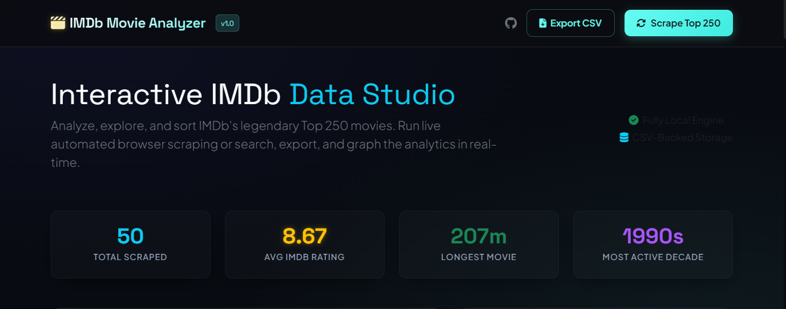
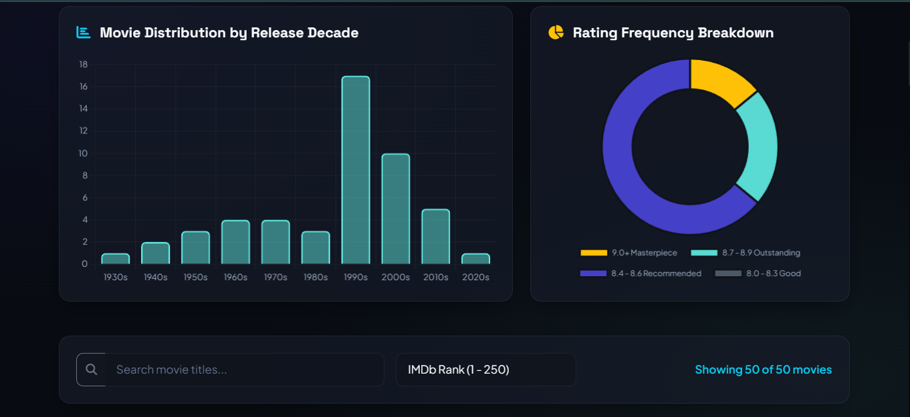
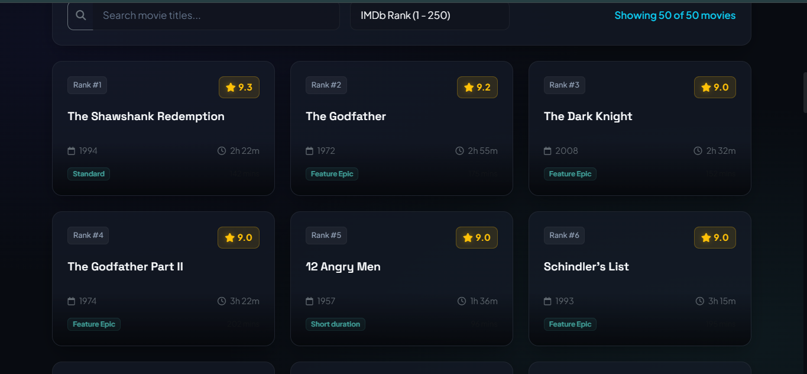
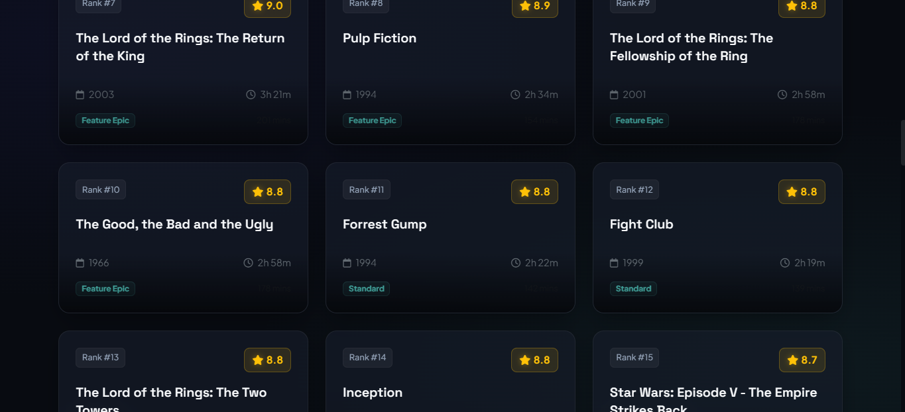

# 🎬 IMDb Movie Analyzer

Welcome to the **IMDb Movie Analyzer**! This is a modern, full-stack, dark-themed dashboard application that lets you scrape, explore, sort, and analyze IMDb's legendary Top 250 movies chart. 

Built with a light and responsive **Python Flask** backend, robust **Selenium** automation, and a visual **Bootstrap 5** frontend, this project is fully local, beginner-friendly, and requires zero API keys or logins.

---

## 🚀 Key Features

1. **Automated Dynamic Scraper**: Launches a headless Selenium Chrome instance to gather live data: Movie Title, IMDb Rating, Release Year, and Runtime from the official IMDb charts.
2. **Glassmorphic Interactive Dashboard**: A highly polished modern dark UI featuring responsive cards, glowing effects, and smooth hover micro-animations.
3. **Visual Data Analytics**: Real-time interactive graphs using **Chart.js** displaying:
   - *Decade Distribution*: Chronological bar chart showing movie count counts per release decade.
   - *Rating Breakdown*: Interactive doughnut chart grouping movies by rating category (e.g. Masterpieces 9.0+, Outstanding 8.7-8.9, etc.).
4. **Instant Client-Side Filtering**: Buttery-smooth instant search to filter by title, and dynamic dropdown sorting (by Rating, Year, Rank, or Duration).
5. **Real-time Live Streaming Console**: Uses **Server-Sent Events (SSE)** to stream live browser automation logs ("Launching Chrome...", "Connecting to IMDb...", "Scraped 25/250...") straight to a glowing console window on the webpage.
6. **Data Export**: Built-in option to export and download the CSV dataset (`movies.csv`) handled via **Pandas**.
7. **Offline/Failure Resilient**: Features a high-fidelity mock dataset fallback, so that if Selenium cannot run (e.g., missing Chrome or network block), the dashboard stays 100% functional and interactive with top-tier movie entries.

---

## 📁 Project Directory Structure

```
imdb_movie_analyzer/
│
├── app.py                  # Flask web server, API routes, and CSV managers
├── scraper.py              # Selenium web scraper engine with anti-bot options
├── requirements.txt        # Backend dependencies (Flask, selenium, pandas, etc.)
├── README.md               # Setup and usage guide (this file!)
├── movies.csv              # Locally cached scraped movie database
│
├── static/                 # Static assets
│   ├── css/
│   │   └── style.css       # Custom premium dark styling, glassmorphism, & animations
│   └── js/
│       └── main.js         # AJAX loaders, search, sorting, SSE, & Chart.js instances
│
└── templates/
    └── index.html          # Dynamic Bootstrap dashboard HTML
```

---

## ⚙️ Prerequisites

Before running the application, make sure you have:
- **Python 3.8 or higher** installed.
- **Google Chrome** browser installed on your computer.

---

## 💻 Installation & Setup

Follow these simple steps to run the application locally on Windows:

### 1. Open your Terminal/PowerShell
Navigate to the project directory:
```powershell
cd "C:\Users\Naveen\.gemini\antigravity\scratch\imdb_movie_analyzer"
```

### 2. Create and Activate a Python Virtual Environment
Creating a virtual environment ensures that the packages do not interfere with other Python setups:
```powershell
# Create the virtual environment
python -m venv venv

# Activate the virtual environment
.\venv\Scripts\Activate.ps1
```

### 3. Install Dependencies
Install all the required python packages using pip:
```powershell
pip install -r requirements.txt
```

### 4. Run the Web Server
Launch the Flask development server:
```powershell
python app.py
```

### 5. Open in your Browser
Once the server starts up, open your web browser and navigate to:
👉 **[http://127.0.0.1:5000](http://127.0.0.1:5000)**

---

## 🛠️ How it Works Under the Hood

### The Scraper (`scraper.py`)
The scraper leverages **Selenium Webdriver** in headless mode (`--headless=new`). Headless mode means the browser runs quietly in the background without opening a visual window. 
To bypass modern web scraper blockades, the scraper includes custom **User-Agent headers** and anti-detection arguments. 
To ensure zero configuration, **`webdriver-manager`** automatically detects your local Chrome version, downloads the matching `chromedriver` executable, and loads it inside your code.

### The Backend Route (`app.py` & SSE)
Unlike standard web apps where a page freezes when clicking "Scrape", this app uses **Server-Sent Events (SSE)**.
When you click **Scrape Top 250**, the frontend starts an `EventSource` subscription to `/api/scrape`. The backend handles the scraping in a stream, generating text logs in real-time. The frontend intercepts these logs and updates a scrolling glowing logging console on the overlay so you can track what the scraper is doing line-by-line!

### Data Handling (`movies.csv`)
On startup, if `movies.csv` is not found, the system auto-generates it using pre-scraped Top 30 movies so the dashboard loads instantly with beautiful widgets.
When a scrape finishes successfully, it overwrites `movies.csv` with the updated list of movies.
The `/api/export` route uses Flask's `send_file` to send the `movies.csv` down as a secure downloadable attachment.
## 📸 Screenshots

### Home Page



### Dashboard Analytics



### Charts Section



### Live Scraping Console

